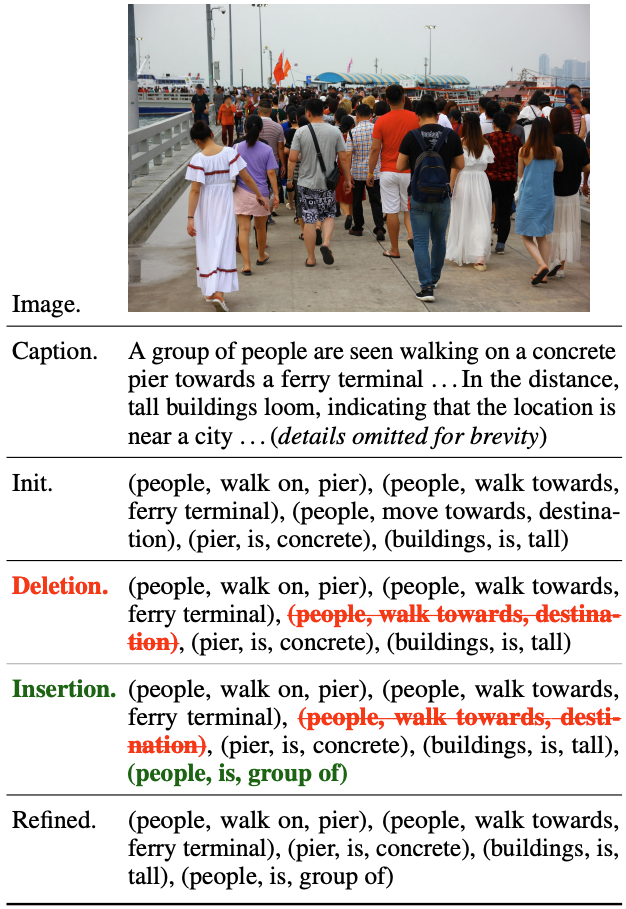
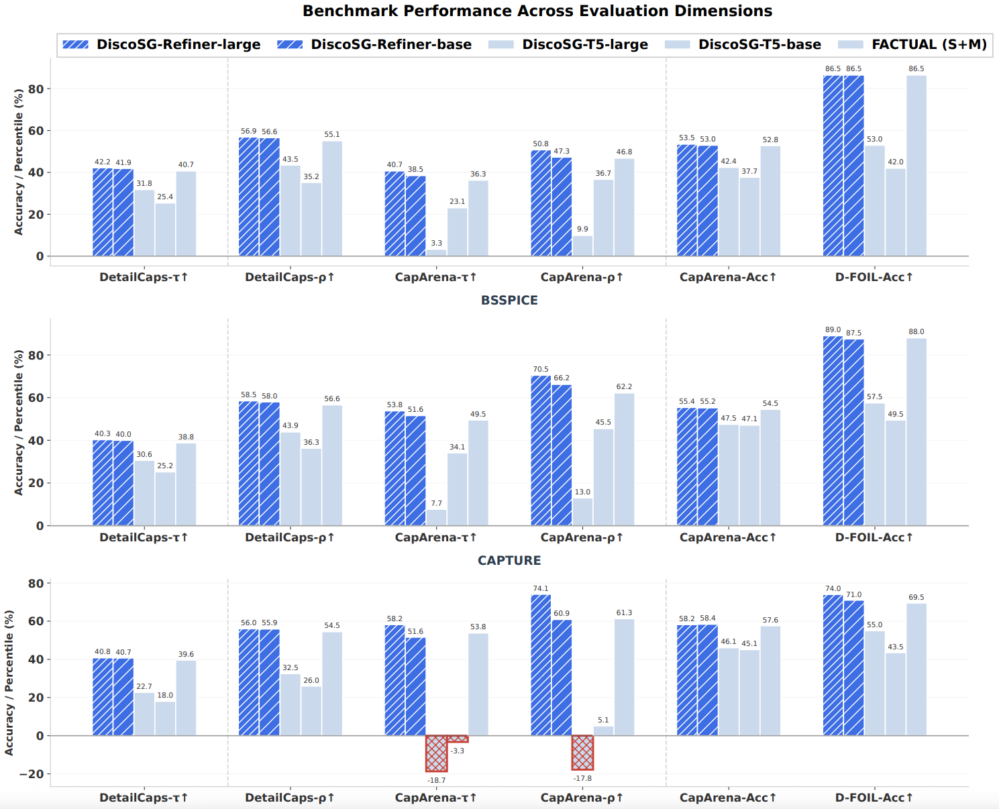

<div align="center">

[](https://2025.emnlp.org/)
[](https://2025.emnlp.org/)
[](https://aclanthology.org/2025.emnlp-main.398/)
[](https://arxiv.org/abs/2506.15583)

**Official repository for "🪩DiscoSG: Towards Discourse-Level Text Scene Graph Parsing through Iterative Graph Refinement"**

*🏆 EMNLP 2025 Outstanding Paper Award (7 of 3,200 accepted papers)*

[Paper](https://aclanthology.org/2025.emnlp-main.398/) | [Code](https://github.com/ShaoqLin/DiscoSG)

</div>

---

## 📰 News

- **[2025-11]** 🎉 Our paper has been selected as an **EMNLP 2025 Outstanding Paper Award (7 of 3,200 accepted papers)**!
- **[2025-08]** Paper accepted to EMNLP 2025 Main Conference
- **[2025-06]** Initial release of DiscoSG-DS dataset and code

---

## 🌟 Highlights

DiscoSG addresses the critical gap in **discourse-level text scene graph parsing** for Vision-Language Models (VLMs):

- 🎯 **Novel Task**: First benchmark for discourse-level (multi-sentence) text scene graph parsing
- 📊 **Rich Dataset**: DiscoSG-DS with 400 expert-annotated + 8,430 synthesized instances
- 🚀 **Efficient Method**: DiscoSG-Refiner achieves **86× faster inference** than GPT-4o with comparable performance
- 🔧 **Practical Impact**: Significant improvements on downstream VLM tasks including caption evaluation and hallucination detection

### Why Discourse-Level Parsing?

Traditional scene graph parsers are designed for **single-sentence captions** and fail to capture:
- ✅ Cross-sentence coreference (e.g., "woman" → "she")
- ✅ Long-range dependencies between sentences
- ✅ Implicit relationships across discourse
- ✅ Global graph coherence

---

## 📊 Dataset: DiscoSG-DS

### Dataset Composition

The **DiscoSG-DS** dataset is located in the `DiscoSG_dataset` folder:

| Split | Human-Annotated | Synthesized | Total |
|-------|----------------|-------------|-------|
| **Train** | 300 | 8,430 | 8,730 |
| **Test (Random)** | 100 | - | 100 |
| **Test (Length)** | 100 | - | 100 |

### Comparison with Existing Benchmarks

| Dataset | # Inst. | Avg Len | Avg Trp | Avg Obj | Avg Rel | Total Trp |
|---------|--------:|--------:|--------:|--------:|--------:|----------:|
| **VG** | 2,966,195 | 5.34 | 1.53 | 1.69 | 1.22 | 4,533,271 |
| **FACTUAL** | 40,369 | 6.08 | 1.76 | 2.12 | 1.57 | 71,124 |
| **TSGBench** | 2,034 | 12.23 | 5.81 | 5.63 | 3.65 | 11,820 |
| **DiscoSG-Human** | 400 | **181.15** | **20.49** | 10.11 | 6.54 | 8,195 |
| **DiscoSG-Synthetic** | 8,430 | **163.07** | **19.41** | 10.06 | 6.39 | 163,640 |

**Legend:**
- **Avg Len**: Average tokens per instance
- **Avg Trp/Obj/Rel**: Average triples/objects/relations per graph
- **Total Trp**: Total triples across dataset

**Key Insight:** DiscoSG instances contain **3× more triples** and **30× longer text** than existing datasets, capturing complex discourse-level relationships across an average of **9.3 sentences** per caption.

### Dataset Creation Pipeline

Our dataset creation follows a two-stage process combining human expertise with active learning:

#### Stage 1: Initial Set Creation

![**\[Initial Set Creation Pipeline\]**](figs/fig1_init_set_creation.png)

<!-- 
Expected image content:
- Fixed Validation Set
- Init. Set Creation (Two-stage annotation)
- Init Finetuned Teacher Model (M₀)
-->

- **Two-stage annotation process** for quality control
- Creates **seed training set** for bootstrapping
- Establishes **baseline teacher model (M₀)**

#### Stage 2: Active Learning

![**\[Active Learning Loop\]**](figs/fig2_acti_learning.png)

<!-- 
Expected image content:
- Seed Training Set
- Batch Selection → Draft Annotation → Two-stage Review → Model Update cycle
- Finetuned Teacher Model (Mᵢ) → Updated Teacher Model (Mᵢ₊₁)
-->

**Four-step iterative process:**
1. **Batch Selection**: Random sampling from unlabeled data
2. **Draft Annotation**: Use current model (Mᵢ) to generate draft annotations
3. **Two-Stage Review**: Human correction and validation
4. **Model Update**: Retrain model (Mᵢ → Mᵢ₊₁) with new annotations

---

## 🔧 Method: DiscoSG-Refiner

DiscoSG-Refiner is a lightweight iterative framework that refines draft scene graphs through a novel **4-step refinement process**.



### Architecture Overview

```
Caption 
→ [Step 1] Initial Graph
→ [Step 2] Deletion
→ [Step 3] Insertion
→ [Step 4] Refined Graph
```

### Four-Step Refinement Process

#### **Step 1: Initial Graph Generation from Sentence-Level Parsing**

| Component | Content |
|-----------|---------|
| **Caption** | A group of people are seen walking on a concrete pier towards a ferry terminal . . . In the distance, tall buildings loom, indicating that the location is near a city . . . (details omitted for brevity) |
| **Caption (split)** | **S1**: A group of people are seen...<br>**S2**: In the distance, tall buildings loom... |
| **Sentence-level Parsing** | **G1**: (people, walk on, pier), (people, walk towards, ferry terminal), (people, move towards, destination), (pier, is, concrete)<br>**G2**: (buildings, is, tall) |
| **1. Init.** | (people, walk on, pier), (people, walk towards, ferry terminal), (people, move towards, destination), (pier, is, concrete), (buildings, is, tall) |

**Process:**
- Split multi-sentence caption into individual sentences
- Parse each sentence independently using sentence-level parser
- Merge sentence-level graphs into initial draft

---

#### **Step 2: Encoder-Based Deletion Prediction**

| Component | Content |
|-----------|---------|
| **1. Init.** | (people, walk on, pier), (people, walk towards, ferry terminal), (people, move towards, destination), (pier, is, concrete), (buildings, is, tall) |
| **Deletion Prediction** | ✅ (people, walk on, pier)<br>✅ (people, walk towards, ferry terminal)<br>❌ (people, move towards, destination)<br>✅ (pier, is, concrete)<br>✅ (buildings, is, tall) |
| **2. Deletion.** | (people, walk on, pier), (people, walk towards, ferry terminal), ~~(people, move towards, destination)~~, (pier, is, concrete), (buildings, is, tall) |

**Process:**
- Encode caption and each graph triple
- Binary classifier predicts **KEEP/DELETE** for each triple
- Removes redundant or incorrect triples

---

#### **Step 3: Decoder-Based Insertion Generation**

| Component | Content |
|-----------|---------|
| **2. Deletion.** | (people, walk on, pier), (people, walk towards, ferry terminal), ~~(people, move towards, destination)~~, (pier, is, concrete), (buildings, is, tall) |
| **Insertion Input** | (people, walk on, pier), (people, walk towards, ferry terminal), (pier, is, concrete), (buildings, is, tall) |
| **Insertion Output** | **(people, is, group of)** |
| **3. Insertion.** | (people, walk on, pier), (people, walk towards, ferry terminal), (pier, is, concrete), (buildings, is, tall), **(people, is, group of)** |

**Process:**
- Encode caption and current graph state after deletion
- Decoder generates missing triples
- Adds complementary information to graph

---

#### **Step 4: Refinement**

| Component | Content |
|-----------|---------|
| **Caption** | A group of people are seen walking on a concrete pier towards a ferry terminal . . . In the distance, tall buildings loom, indicating that the location is near a city . . . (details omitted for brevity) |
| **1. Init.** | (people, walk on, pier), (people, walk towards, ferry terminal), (people, move towards, destination), (pier, is, concrete), (buildings, is, tall) |
| **2. Deletion.** | (people, walk on, pier), (people, walk towards, ferry terminal), ~~(people, move towards, destination)~~, (pier, is, concrete), (buildings, is, tall) |
| **3. Insertion.** | (people, walk on, pier), (people, walk towards, ferry terminal), (pier, is, concrete), (buildings, is, tall), **(people, is, group of)** |
| **4. Refined.** | (people, walk on, pier), (people, walk towards, ferry terminal), (pier, is, concrete), (buildings, is, tall), (people, is, group of) |

**Process:**
- Execute deletion (Step 2)
- Execute insertion (Step 3)
- **(Optional)** Repeat refinement cycle for further improvement

---

### Key Advantages

| Feature | DiscoSG-Refiner | GPT-4o | Traditional Parsers |
|---------|----------------|---------|---------------------|
| **Speed** | ⚡ 86× faster | Baseline | Fast but inaccurate |
| **Accuracy** | 🎯 Comparable | Highest | Poor on discourse |
| **Cost** | 💰 Low | Very High | Low |
| **Open Source** | ✅ Yes | ❌ No | ✅ Yes |

---

## 🚀 Quick Start

### Prerequisites

```bash
# Clone the repository
git clone https://github.com/ShaoqLin/DiscoSG.git
cd DiscoSG

# Install dependencies
pip install -r requirements.txt
```

### 1. Dataset Configuration

Configure dataset paths in the following files:

**`detailcap_discosg_mr.py`** (line 64):
```python
# Replace with your path to DiscoSG_datasets directory
dataset_path = "path/to/DiscoSG_datasets"
```

**`dataset_utils.py`** (lines 136, 167):
```python
# Replace with your path to DiscoSG_datasets directory
dataset_path = "path/to/DiscoSG_datasets"
```

> 💡 **Note:** Use the same dataset settings as [DetailCaps](https://github.com/foundation-multimodal-models/CAPTURE) and [CapArena](https://github.com/njucckevin/CapArena)

### 2. Fast Inference with Reusable Graphs

For quick inference, use pre-computed graphs from the `reusable_graph` directory:

```bash
python detailcap_discosg_mr.py \
  --original_parse_dict reusable_graph/original_parse.json \
  --sub_sentence_parse_dict reusable_graph/sub_sentence_parse.json \
  --combined_parse_dict reusable_graph/combined_parse.json
```

**Available parameters:**
```python
parser.add_argument("--original_parse_dict", type=str, default=None, 
                   help="Path to the original parse dict file")
parser.add_argument("--sub_sentence_parse_dict", type=str, default=None, 
                   help="Path to the sub sentence parse dict file")
parser.add_argument("--combined_parse_dict", type=str, default=None, 
                   help="Path to the combined parse dict file")
```

### 3. CAPTURE Metric Setup

Replace the default `capture.py` with our modified version:

```bash
# Download CAPTURE metric from official repo
wget https://raw.githubusercontent.com/foundation-multimodal-models/CAPTURE/main/capture.py

# Replace with our modified version
cp capture.py path/to/CAPTURE/capture.py
```

### 4. Reproduction Materials

We provide comprehensive materials for result verification:

- **📋 Complete inference logs** from our experiments
- **📊 Intermediate graph structures** during inference
- **🔄 Pre-computed reusable graphs** for fast inference

These materials enable researchers to **verify and reproduce our results**.

---

## 📈 Experimental Results

### Discourse-Level Text Scene Graph Parsing

Performance on DiscoSG-DS test sets:

| Method | Random Test |  | Length Test |  |
|--------|------------|--|-------------|--|
|        | SPICE ↑ | BSSPICE ↑ | SPICE ↑ | BSSPICE ↑ |
| **Sentence Parsing & Merging** |
| Stanford Parser | 17.0 | 81.5 | 19.5 | 83.1 |
| FACTUAL-T5-base | 49.4 | 90.9 | 52.7 | 92.0 |
| **End-to-End (Discourse)** |
| DiscoSG-T5-large | 69.4 | 95.1 | 53.0 | 91.8 |
| DiscoSG-Qwen2.5-1.5B | 65.2 | 94.3 | 51.6 | 89.5 |
| **Few-Shot Prompting** |
| GPT-4o (text-only) | 53.2 | 91.7 | 52.5 | 92.0 |
| GPT-4o (multimodal) | 55.6 | 92.3 | 54.4 | 92.4 |
| **DiscoSG-Refiner** |
| DiscoSG-Refiner-base | 64.3 | 94.3 | 67.3 | 95.1 |
| DiscoSG-Refiner-large | 66.2 | 94.7 | 67.3 | 95.2 |
| **DiscoSG-Refiner-xl** | **66.7** | **94.9** | **68.6** | **95.4** |

**Key Findings:**
- ✅ DiscoSG-DS enables significantly better discourse parsing
- ✅ DiscoSG-Refiner offers the **best performance-resource trade-off**
- ✅ Outperforms GPT-4o while being **86× faster**

### Downstream VLM Tasks

#### Image Caption Evaluation (CapArena & DetailCaps)

Graph-based metrics with DiscoSG-Refiner achieve **top performance** across multiple benchmarks:

- **CapArena**: Best correlation with human judgments
- **DetailCaps**: Superior performance on detailed caption evaluation

#### Hallucination Detection (D-FOIL)

DiscoSG-Refiner-based metrics excel at detecting hallucinations in VLM outputs, demonstrating the practical value of accurate discourse-level scene graphs.



---

## 📁 Directory Structure

```
DiscoSG/
├── detailcap_discosg_mr.py          # Main inference script for DetailCaps
├── caparena_mr.py                    # CapArena evaluation script
├── discourse_foil_acc_mr.py          # D-FOIL hallucination detection
├── dataset_utils.py                  # Dataset utilities
├── capture.py                        # Modified CAPTURE metric
│
├── DiscoSG_datasets/                 # Dataset files
│   ├── train/                        # Training set (8,730 instances)
│   │   ├── human_annotated/          # 300 human-annotated
│   │   └── synthesized/              # 8,430 synthesized
│   └── test/                         # Test sets (200 instances)
│       ├── random/                   # Random test (100)
│       └── length/                   # Length test (100)
│
├── reusable_graph/                   # Pre-computed graphs for fast inference
│   ├── Disco_large_subsent_100.json
│   ├── original_parse.json
│   ├── sub_sentence_parse.json
│   └── combined_parse.json
│
└── logs/                             # Inference logs and intermediate results
    ├── inference_logs/
    └── intermediate_graphs/
```

---

## 📖 Citation

If you find our work helpful, please cite our papers:

```bibtex
@inproceedings{lin-etal-2025-discosg,
    title = "{D}isco{SG}: Towards Discourse-Level Text Scene Graph Parsing through Iterative Graph Refinement",
    author = "Lin, Shaoqing and Teng, Chong and Li, Fei and Ji, Donghong and Qu, Lizhen and Li, Zhuang",
    editor = "Christodoulopoulos, Christos and Chakraborty, Tanmoy and Rose, Carolyn and Peng, Violet",
    booktitle = "Proceedings of the 2025 Conference on Empirical Methods in Natural Language Processing",
    month = nov,
    year = "2025",
    address = "Suzhou, China",
    publisher = "Association for Computational Linguistics",
    url = "https://aclanthology.org/2025.emnlp-main.398/",
    doi = "10.18653/v1/2025.emnlp-main.398",
    pages = "7848--7873",
    isbn = "979-8-89176-332-6"
}

@inproceedings{li-etal-2023-factual,
    title = "{FACTUAL}: A Benchmark for Faithful and Consistent Textual Scene Graph Parsing",
    author = "Li, Zhuang and Chai, Yuyang and Zhuo, Terry Yue and Qu, Lizhen and 
              Haffari, Gholamreza and Li, Fei and Ji, Donghong and Tran, Quan Hung",
    booktitle = "Findings of the Association for Computational Linguistics: ACL 2023",
    month = jul,
    year = "2023",
    address = "Toronto, Canada",
    publisher = "Association for Computational Linguistics",
    url = "https://aclanthology.org/2023.findings-acl.398",
    pages = "6377--6390"
}
```

---

## 🤝 Acknowledgments

We are grateful to:
- [**Dr. Zhuang Li**](https://zhuang-li.github.io/) for his exceptional mentorship and generous support throughout this research
- The authors of [FACTUAL](https://aclanthology.org/2023.findings-acl.398), [DetailCaps](https://github.com/foundation-multimodal-models/CAPTURE), and [CapArena](https://github.com/njucckevin/CapArena) for their foundational work

---

<div align="center">

**⭐ If you find this work useful, please star our repository! ⭐**
</div>